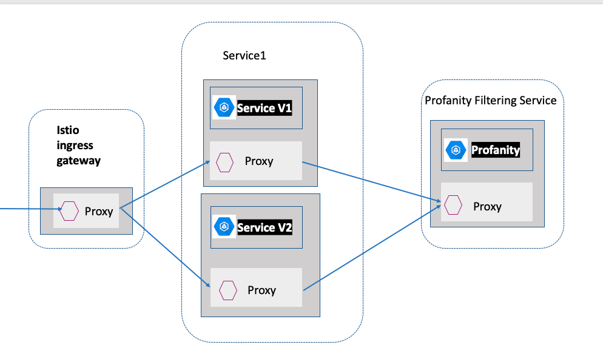

# Sample Spring Boot Application #
Sample Spring Boot Application uses Istio service mesh for telemetry features like monitoring, tracing, logs and rate limiting.

## How To Run

To run the application locally, enter the root directory of the application using the command line and type:

```
mvn clean package
java -jar target/spring-boot-hello-world-1.0-SNAPSHOT.jar
``` 

### Installing Istio on Kubernetes
Following the instructions for installing the Istio control plane on Kubernetes for your platform.

#### Build the Project
```
mvn clean package
``` 
### Build the Docker Image
```
docker build -t springboot-service .
```
Push the images to your platform cluster repository.

### Deployment
Deploy your application using the kubectl command:
```
kubectl apply -f springboot-service.yaml
```
### Telemetry
Follow the [Istio telemetry docs](https://istio.io/docs/tasks/telemetry/) to apply config files.
- https://istio.io/docs/tasks/telemetry/
- https://istio.io/docs/examples/telemetry/

### Request Routing
https://istio.io/docs/tasks/traffic-management/request-routing/

### Denials and White/Black Listing
- https://istio.io/docs/tasks/policy-enforcement/denial-and-list/
- https://istio.io/docs/concepts/policies-and-telemetry/

### Rate Limiting
- https://istio.io/docs/tasks/policy-enforcement/rate-limiting/
- https://istio.io/docs/reference/config/policy-and-telemetry/adapters/redisquota/
- https://istio.io/docs/reference/config/policy-and-telemetry/attribute-vocabulary/
- https://istio.io/docs/reference/config/policy-and-telemetry/expression-language/

### Postman Collection
[Check it here](postman_collection.json)

### Service Mesh


## Reference
- https://istio.io/docs/concepts/what-is-istio/ 
- https://blog.envoyproxy.io/service-mesh-data-plane-vs-control-plane-2774e720f7fc

## Slides
[slides.pdf](https://github.com/jofen-misc/spring-boot-istio-example/blob/master/slides.pdf)


